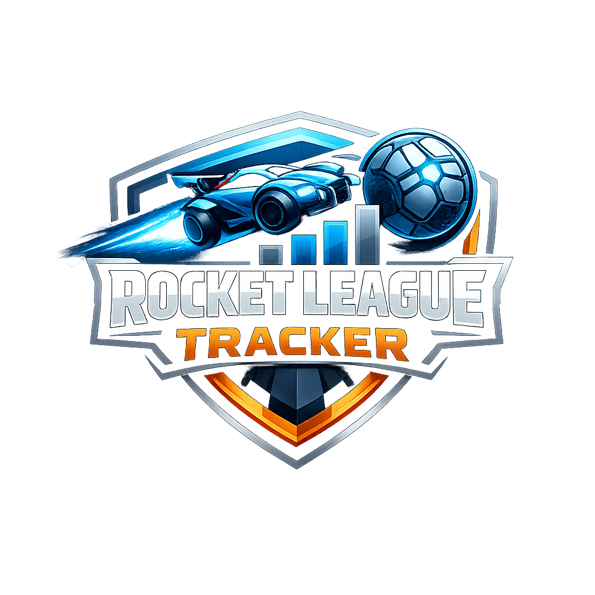
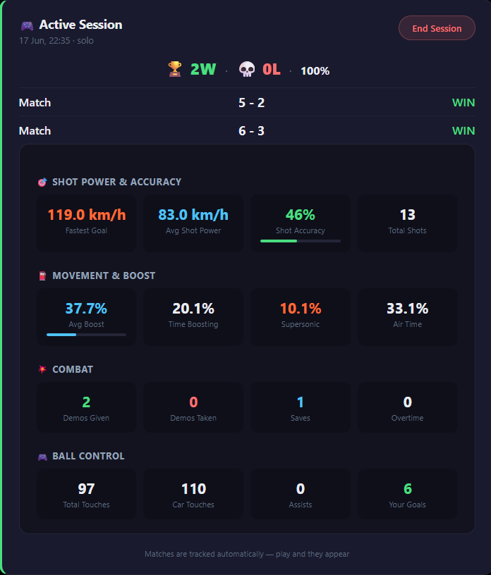
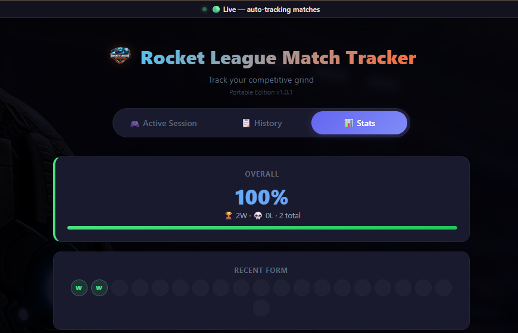
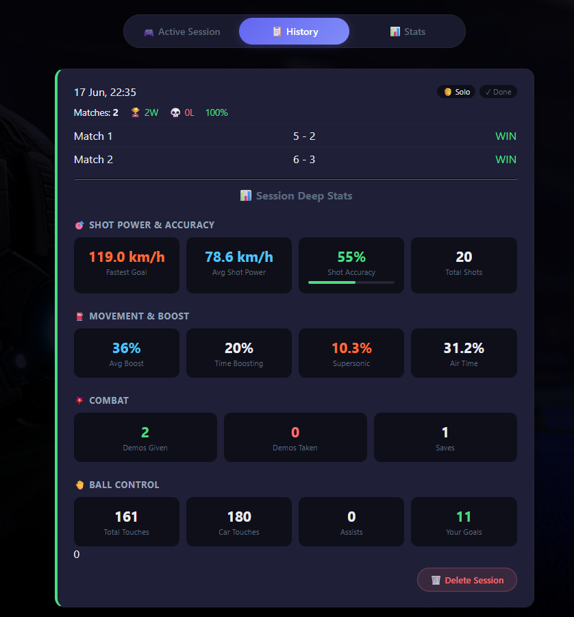

   
  <h1>🚀 RocketTracker</h1>
  
<strong>Auto-track every Rocket League match — no install, no Python, no WSL.</strong>

  
Double-click the .exe and play. Stats appear automatically.

  
  &nbsp;
  
  &nbsp;
  
  &nbsp;
  

---

 📦 Download ZIP → Extract to Desktop → Double-click → Play

---

## 📸 Screenshots

<table>
<tr>
  <td width="50%" align="center"><b>🎮 Active Session</b> Live match scores & per-match deep stats</td>
  <td width="50%" align="center"><b>📋 History</b> Browse past sessions, click to expand</td>
</tr>
<tr>
  <td></td>
  <td></td>
</tr>
<tr>
  <td width="50%" align="center"><b>📊 Stats Overview</b> All-time analytics with deep breakdowns</td>
  <td width="50%" align="center"><b>🔍 Session Deep Stats</b> Aggregate stats per completed session</td>
</tr>
<tr>
  <td></td>
  <td></td>
</tr>
</table>

---

## ✨ What It Tracks

| Category | Stats |
|:--------:|-------|
| 🎯 **Shot Power** | Fastest goal (km/h), avg shot power, shot accuracy %, total shots |
| ⛽ **Movement** | Avg boost %, time boosting %, supersonic %, air/ground/wall time % |
| 💥 **Combat** | Demos given, demos taken, saves, overtime matches |
| 🎮 **Ball Control** | Total touches, car touches, assists, your goals |
| 👥 **Duo Mode** | Auto-detects when your friend is on your team |
| 📋 **Sessions** | Auto-creates sessions, keeps full history |

---

## 🚀 Quick Start

1. **Download** the [latest ZIP](https://github.com/magnificolv/RocketTracker/releases/latest) (~13 MB)
2. **Extract** to your Desktop — keep the `RL-Tracker\` folder together, don't move the .exe out
3. **Double-click** `RL-Tracker-v1.3.0.exe` — a console window opens, your browser opens the dashboard at `http://localhost:3010`
4. **Enter your name** in ⚙️ Settings → click **Auto-Create** → restart Rocket League → play!

> 💡 First time? Auto-Create sets up everything automatically. Just restart RL once.

---

## 🔧 Troubleshooting

**Tracker shows "RL not running" but RL IS running?**  
Click ⚙️ Settings → **🔍 Diagnose**. It checks your config, port, and running processes, then tells you exactly what to fix.

**Using WSL2 / Docker Desktop?**  
WSL2 can silently intercept port 49123. Quick fix: run `wsl --shutdown` in PowerShell. Permanent fix: add `ignoredPorts=49123` to `%USERPROFILE%\.wslconfig` under `[wsl2]`.

**Windows Defender flags the .exe?**  
False positive — the file is unsigned. Click `Keep anyway` in your browser, or restore from Windows Security → Protection history.

---

## 🔄 Auto-Update

The tracker checks GitHub for new versions. When an update is available, you'll see it in Settings — one click downloads and installs the new version, preserving your stats.

---

## 📝 Version History

| Version | Date | Changes |
|:-------:|:----:|---------|
| **v1.3.0** | Jun 21 | Auto-Create now fixes **both** INI files (including install-dir DefaultStatsAPI.ini that RL reverts to PacketSendRate=0). Copy All diagnostics button. |
| **v1.2.0** | Jun 21 | New icon, seamless one-click auto-update |
| **v1.1.0** | Jun 21 | Auto-update check from GitHub |
| **v1.0.9** | Jun 21 | Waitress WSGI server, Ground/Wall Time UI fix |
| **v1.0.8** | Jun 21 | Team swap bug fix — scores no longer flip mid-session |
| **v1.0.7** | Jun 21 | WSL2 port-forwarding detection in diagnostics |
| **v1.0.5** | Jun 21 | Self-serve diagnostics (🔍 Diagnose button) |
| **v1.0.4** | Jun 20 | GLM 5.2 code review — 17 fixes |
| **v1.0.0** | Jun 17 | First public release |

---

Built with ❤️ by **Magnifico** & **Hermes AI Collective**

[🐛 Report Bug](https://github.com/magnificolv/RocketTracker/issues) · [📦 All Releases](https://github.com/magnificolv/RocketTracker/releases) · [⭐ Star the repo](https://github.com/magnificolv/RocketTracker/stargazers)

