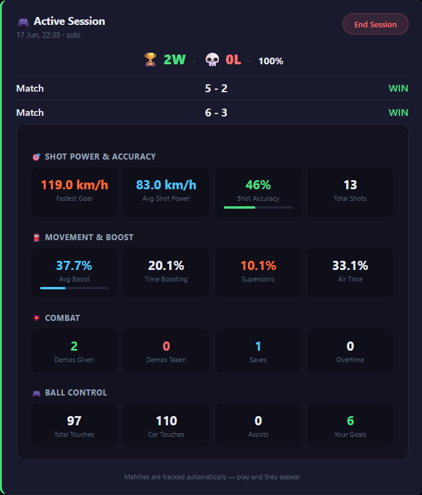
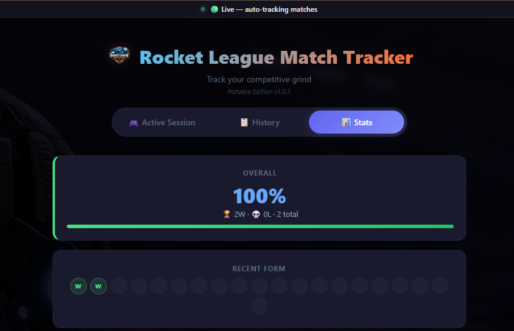
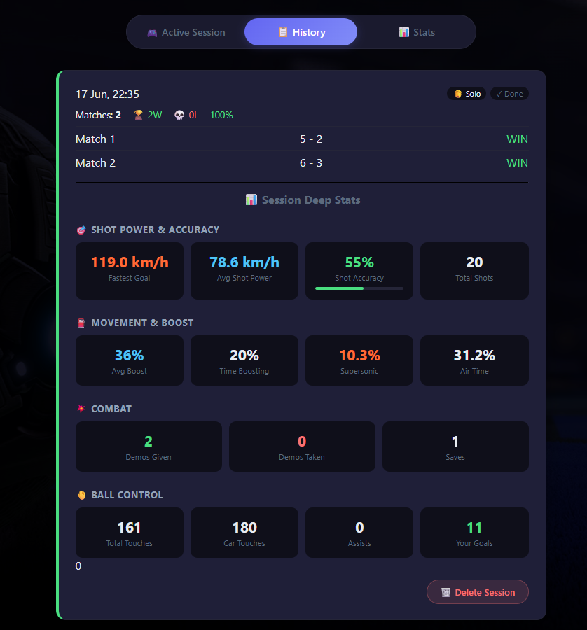

# 🚀 Rocket League Match Tracker v3.0.0

  
  &nbsp;
  
  &nbsp;
  
  &nbsp;
  

---

 📦 Download ZIP → Extract to Desktop → Double-click → Play

---

## 📸 Screenshots

<table>
<tr>
  <td width="50%" align="center"><b>🎮 Active Session</b> Live match scores & per-match deep stats</td>
  <td width="50%" align="center"><b>📋 History</b> Browse past sessions, click to expand</td>
</tr>
<tr>
  <td></td>
  <td></td>
</tr>
<tr>
  <td width="50%" align="center"><b>📊 Stats Overview</b> All-time analytics with deep breakdowns</td>
  <td width="50%" align="center"><b>🔍 Session Deep Stats</b> Aggregate stats per completed session</td>
</tr>
<tr>
  <td></td>
  <td></td>
</tr>
</table>

---

## ✨ What It Tracks

Auto-tracks competitive Rocket League matches via the local Stats API:

- Win / loss, scores, overtime
- Solo / duo mode (friend detection)
- Shots, saves, assists, demos
- Boost, air, ground, wall, supersonic time
- Shot power + coach insights
- Session history + all-time stats

---

## 🚀 Quick Start

1. **Download** the [latest ZIP](https://github.com/magnificolv/RocketTracker/releases/latest)
2. **Extract** to your Desktop — keep the `RL-Tracker\` folder together
3. **Double-click** `RL-Tracker-v3.0.0.exe` — browser opens `http://localhost:3010`
4. **Enter your name** in ⚙️ Settings → **Auto-Create** → restart Rocket League → play!

> 💡 First time? Auto-Create sets up the Stats API config. Restart RL once so it takes effect.

---

## 🔧 Troubleshooting

**Tracker shows "RL not running" but RL IS running?**  
Settings → Auto-Create, then fully quit and relaunch Rocket League.

**Using WSL2 / Docker Desktop?**  
WSL2 can intercept port 49123. Quick fix: `wsl --shutdown`. Permanent: add `ignoredPorts=49123` under `[wsl2]` in `%USERPROFILE%\.wslconfig`.

**Windows Defender flags the .exe?**  
False positive on unsigned portable apps. Choose *Keep anyway* / restore from Protection history.

---

## 🔄 Auto-Update

Open ⚙️ Settings → **Check for Updates** → **One-Click Update**.  
Your `data-v2.db` and `config.yaml` are preserved.

---

## 🛠️ For Friends

1. Download latest release ZIP
2. Extract and run the `.exe`
3. Enter **your** Rocket League display name
4. Play — each person keeps their own stats DB

---

## 📝 Version History

| Version | Date | Changes |
|---------|------|---------|
| **v3.0.0** | Aug 3, 2026 | Bugfixes: wall time, match dedup, session badges, duo late-join; visual upgrade; session deep stats |
| v2.0.15 | Jul 1, 2026 | Scores from GoalScored only (no cumulative Teams[].Score) |
| v2.0.14 | Jul 1, 2026 | OT score regression guard |
| v2.0.13 | Jun 30, 2026 | Auto-update for source releases + session badge JOIN |
| v2.0.12 | Jun 30, 2026 | Form dots chronological order |
| v2.0.11 | Jun 28, 2026 | Badge undefined fix |

---

Built with ❤️ by **Magnifico** & **Hermes AI Collective**

